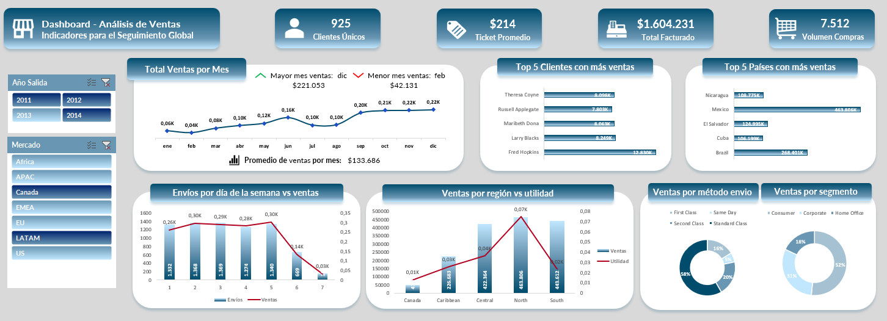

# 📊 Análisis de ventas en Excel – Supermercado (2014)

## 🎯 Objetivo
Analizar las ventas realizadas por un supermercado con presencia global durante los años 2011 a 2014, con el fin de identificar los KPI's relevantes con la venta de productos y sus clientes.

## 🔖 Dataset
- **Fuente:** Curso: Experto en Análisis y Visualización de Datos - Udemy
- **Archivo:** `Ventas_Supermercado.xlsx`

## 🛠️ Herramientas
- Microsoft Excel (tablas dinámicas, gráficos dinámicos y segmentadores)
- Funciones: SUMAR.SI.CONJUNTO, TEXTO, FECHA, CONTAR.SI, BUSCARV.

## 📈 Métricas generadas
1. Clientes únicos
2. Ticket promedio
3. Total facturado
4. Volumen de compras
5. Ventas totales por mes
6. Clientes con más compras
7. Países con más ventas
8. Envios por día de la semana vs la cantidad de ventas
9. Ventas por región vs la utilidad generada
10. Ventas por cada método de envio
11. Ventas por cada segmento 

## 🖼️ Visualizaciones


## 🧠 Hallazgos
- Las ventas totales fueron de **$1.604.231**
- El promedio de ventas es de **$213,56**
- El volumen de compras es de **7.512**
- El promedio de días por entrega es de **4 días**
- El día de la semana en donde más se vende es el día **viernes** con un total de **$304.219,70** vendidos
- El método de envío con más ventas es **Standard Class** con el **58.32%** de las ventas
- El segmento en el que más se vende es **Consumo** con el **51.55%**
- Las categorías con más ventas son: **Appliances, Bookcases, Chairs,  Copiers, Phones**
- El mes con más ingresos generados es **diciembre** con **$221.053,07** y el mes con menos ingresos es **febrero** con **$42.131,25**
- El mes con más ventas realizadas fue noviembre con **1.014** ventas y el mes con menos ventas fue **febrero** con **207** ventas
- La región con más ingresos generados es **El Sur**, con una utilidad de **$23.316,99**
- En total hay **925** clientes únicos
- El cliente que más consume es **Fred Hopkins** con un total de **$12.830,40**
- Los países en el top 5 con más ventas son: **Brasil, Cuba, El Salvador, México y Nicaragua**

## 📂 Estructura
```
/01-Analisis-datos-excel/
│
├── data/
│   └── Ventas_Supermercado.xlsx
│
├── documentos/
│   └── Planeacion.md
│   └── Resumen_fundamentos.md
│
├── entregable/
│   └── Ventas_Supermercado.xlsx
│   └── 1_Dashboard_dinamico.png
│
├── README.md
```

## 🧹 Limpieza realizada:
- Formato de fecha uniforme (DD-MM-YYYY)
- Normalización de texto
- Creación de identificador únicos para las facturas y clientes
- Creación de columnas para análisis

## 🧪 Lecciones aprendidas
Aprendí que es posible el análisis de datos por medio de excel, por medio de la creación de gráficos dinámicos e interactivos. Adicionalmente, reforce mi opinión de que las funciones de excel nos permiten hacer casi cualquier cosa para la limpieza de los datos.